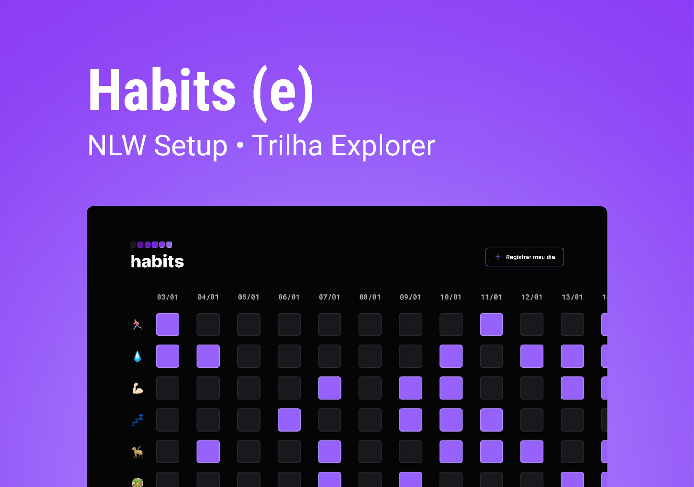

<h1 align="center"> Habits </h1>

NLW é um evento exclusivo e gratuito, promovido pela Rocketseat para ensino de tecnologias WEB.  

 

  

# 🚀 Tecnologias 
Esse projeto foi desenvolvido com as seguintes tecnologias: 
- HTML e CSS 
- JavaScript 
- Git e Github 
- Figma 
# 💻 Projeto 
O Habits é um app para ajudar a rastrear os hábitos. 
- [Visite o projeto online](https://mateusfurt.github.io/nlw-setup/)

## 🔖 Layout

Você pode visualizar o layout do projeto através [DESSE LINK](https://www.figma.com/community/file/1187422022288947321). É necessário ter conta no [Figma](https://figma.com) para acessá-lo.
